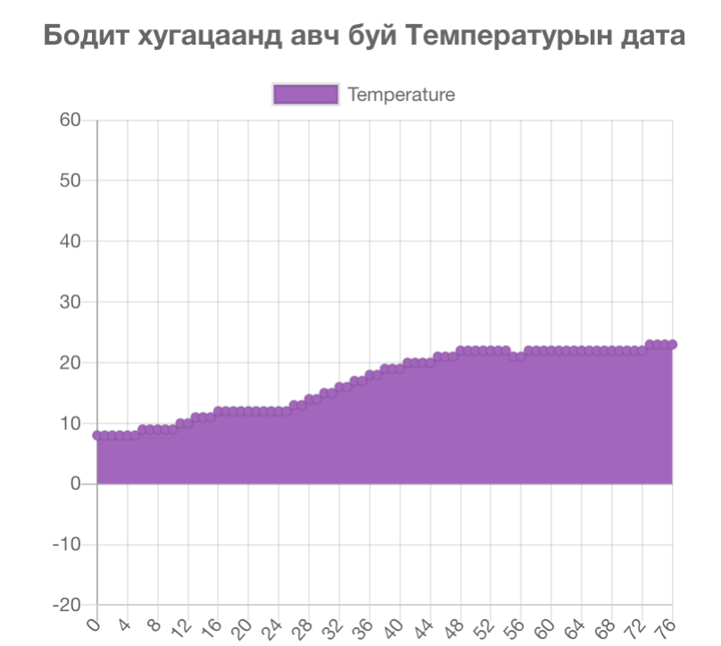

# Pixelab IoT Lab

[](https://en.wikipedia.org/wiki/Internet_of_things)


DHT22 сенсорын утгыг сериал портоор авч дэлгэцэнд бодит хугацаанд график байгуулан харуулж буй Vue.js framework дээр суурилсан прожект юм.

# Юу мэдэх шаардлагатай вэ!

  - Vue.js
  - Serial UART, RS232
  - Arduino ESP8266 WiFi board
  - Socket connection
  - Node.js server


> Энэхүү прожект нь 3 үндсэн хэсгээс бүрдэх бөгөөд
> үүнд Vue.js (Front-ent), node сервер (Back-end),
> Arduino дээрх програм гэсэн IoT технологийн 
> Local орчинд хэрхэн ажиллуулах тухай прожект болой.


# Харагдах байдал



## Front-end-г тохируулга хийж хэрэгтэй package-уудыг суулгах комманд
```
cd frontend
npm install
```

### Эх кодыг хөрвүүлж ажиллуулах комманд
```
npm run serve
```

## Back-end-г тохируулга хийж хэрэгтэй package-уудыг суулгах комманд
```
cd server
npm install
```

### Эх кодыг хөрвүүлж ажиллуулах комманд
```
node app.js